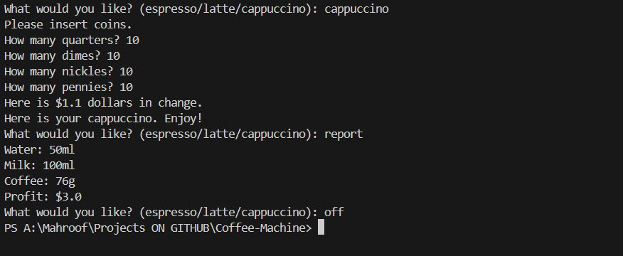

# Coffee Machine

[](https://www.python.org/)
[](LICENSE)


This project is a simple and educational command-line Python application that simulates a virtual coffee machine. It allows users to select popular coffee drinks such as espresso, latte, and cappuccino, manage payment by inserting coins, and track ingredient resources to ensure the machine can fulfill the orders. The project demonstrates fundamental programming concepts including input handling, conditionals, resource management, and basic calculations.

It is designed for Python learners to practice building interactive CLI applications and for anyone interested in exploring how vending machine logic can be implemented programmatically. Future enhancements could include adding more drink options, custom pricing, and more comprehensive resource tracking.

## Table of Contents

- [Features](#features)
- [Demo](#demo)
- [Requirements](#requirements)
- [Usage](#usage)
- [Project Structure](#project-structure)
- [Contributing](#contributing)
- [License](#license)
- [Author](#author)
- [FAQ](#faq)
- [Getting Help](#getting-help)


## Features
- Interactive CLI for drink selection
- Accepts coin input (quarters, dimes, nickels, pennies)
- Handles resources and notifies if ingredients are insufficient
- Calculates, refunds, or charges the user based on payment
- Tracks profit for sales

## Demo
Below is an example interaction:
```
What would you like? (espresso/latte/cappuccino):
Please insert coins.
How many quarters? 4
How many dimes? 0
How many nickels? 0
How many pennies? 0
Here is your espresso. Enjoy!
```



## Requirements

- Python 3.x (No external dependencies required)


## Usage

1. Clone the repository:  https://github.com/MohammadMahroof/Coffee-Machine.git
2. Navigate to the project directory: cd Coffee-Machine
3. Run the program: python main.py
4. Follow on-screen prompts to order coffee and insert coins.


## Project Structure

| File       | Description                                       |
|------------|---------------------------------------------------|
| main.py    | Main program file containing the core logic       |
| README.md  | Project overview, setup, usage, and documentation |
| Output.png | Screenshot demonstrating the program output       |
 

## Contributing

Contributions are welcome! Please fork the repository and submit a pull request. For major changes, open an issue to discuss your proposal and ensure alignment.

## License

This project is licensed under the [MIT License](LICENSE).

## Author

[Mohammad Mahroof](https://github.com/MohammadMahroof) — Python Developer & Enthusiast


## FAQ

**Q: Can I customize drinks?**  
A: Currently not, but feature requests are welcome.

**Q: Does it support other currencies?**  
A: No, only US coins are supported now.


## Getting Help

If you have any questions or issues, feel free to open an issue on this repository or contact me at [mohammadmahroof@29gmail.com].


